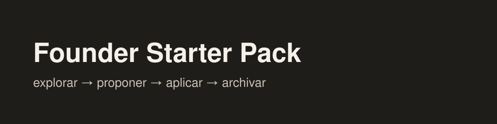

# Founder Starter Pack

Marketplace de plugins de productividad para [Claude Code](https://code.claude.com), en español.

## Plugins disponibles

| Plugin | Qué hace | Comandos |
|---|---|---|
| [`proyectos`](plugins/proyectos/) | El ciclo de trabajo de una empresa en Markdown: explorar → proponer → aplicar → archivar, con reglas, plantillas y validador | `/proyectos:init` · `setup` · `explorar` · `proponer` · `aplicar` · `archivar` · `validar` · `reglas` |
| [`contenido`](plugins/contenido/) | Redactores que escriben con tu propia voz (uno por grupo de temas) y una parrilla de contenidos en Notion, Airtable o ClickUp, con tus formatos de publicación definidos por canal. El proceso de cada pieza va en tres pasos: proponer temas, redactar y publicar, con la pieza visual armada con tu estilo. `/contenido:setup` te guía desde cero hasta tu primera publicación | `/contenido:setup` · `construir-redactores` · `construir-formatos` · `construir-estilo` · `construir-parrilla` · `post-proponer` · `post-redactar` · `post-disenar` · `post-publicar` |

## Instalación

### Claude Code: app de escritorio

Pestaña *Code*: botón **+** junto al cuadro de texto → **Plugins** → **Add plugin** → agrega el marketplace
`emmanuelbarturen/founder-starter-pack` → instala el plugin que quieras.

### Claude Code: terminal

```
claude plugin marketplace add emmanuelbarturen/founder-starter-pack
claude plugin install proyectos@founder-starter-pack
```

### Actualizar

`/plugin` → *Marketplaces* → `founder-starter-pack` → *Update*. Para recibir cambios solos, activa
*Enable auto-update* en ese mismo menú.

## Versiones

El historial de `proyectos` está en [plugins/proyectos/VERSIONS.md](plugins/proyectos/VERSIONS.md).

## Licencia

MIT.
